# WebGL初识

## 产生背景 

WebGL是一种3D绘图标准，这种绘图技术标准允许把 Javascrip和OpenGL ES 2.0结合在一起，通过增加OpenGL ES 2.0的一个上下文环境，WebGL可以为HTML5 Canvas提供3D支持。这样Web开发者就可以使用JavaScript语言调用OpenGL ES 2.0，借助系统显卡在浏览器里流畅地展示3D场景和模型了，还能创建复杂的导航和数据视觉化。 

webgl（web图形库 Web Giaphics Library）是一种 Javascript API，用于在任何兼容的 Web 浏览器中渲染高保真 2D/3D 图形，以实现交互式图像内容。WebGL完全集成到浏览器的所有网页标准中，可将影像处理和图形渲染工作交给 GPU 处理，从而大幅提高 Web 3D 性能。WebGL程序由 JavaScript 语言编写的句柄和OpenGL Shading Lanugage(GLSL)编写的着色器代码组成。

## 工作原理

webgl的工作方式和流水线类似，将一个绘图过程分为多个步骤，当前步骤只对前一步骤的结果进行处理，然后将处理后的结果传给下一个步骤，最后将处理结果渲染到2D屏幕上。业界把这种渲染方式称之为 **图形管线** 或者 **渲染管线**。

GPU渲染管线的主要过程：
1. 首先进入顶点着色器阶段，利用GPU的并行计算优势对顶点逐个进行坐标变换；
2. 然后进入图源装配阶段，将顶点按照图源类型组装成图形；
3. 接下来进入光栅化阶段，将图形进行栅格化处理，用不包含颜色信息的像素填充；
4. 最后进入片段着色器阶段，对像素进行着色处理，生成最终的图像，显示在屏幕上。


::: info
#### GLSL 着色器
GLSL 是一门特殊的有着类似于 C 语言的语法，在图形管道 (graphic pipeline) 中直接可执行的 OpenGL 着色语言。着色器有两种类型——顶点着色器 (Vertex Shader) 和片段着色器（Fragment Shader）。前者是将形状转换到真实的 3D 绘制坐标中，后者是计算最终渲染的颜色和其他属性用的。

GLSL 不同于 JavaScript, 它是强类型语言，并且内置很多数学公式用于计算向量和矩阵。

#### OpenGL

一种兼容多种语言使用的开放式图形化语言，提供了制作 2D/3D 图像的API, 该语言类似 C/C++，并在计算机的图形处理器（GPU）上运行。

:::


## WebGL 可绘制图元

WebGL 允许绘制**点**、**线段**和**三角形**三种图源。

1. 点 (points)

    点是 WebGL 中最小的图元。它只有一个位置坐标，没有大小，也没有颜色。
2. 线 (lines)

    线是由两个顶点构成的。线有宽度，但宽度为 1px 时，实际上就是一条直线。
3. 三角形 (triangles)

    面是由三个顶点构成，可以看作是由三条线围成的图形。

## 着色器

### 顶点着色器

用来描述顶点特征的程序，顶点着色器操作 3D 空间的坐标并且每个顶点都会调用一次这个函数。其目的是设置 `gl_Position` 变量——这是一个特殊的全局内置变量，它是用来存储当前顶点的位置：

```glsl
void main() {
    gl_Position = makeCalculationsToHaveCoordinates;
}
```

这个 `void main()` 函数是定义全局 `gl_Position` 变量的标准方式。所有在这个函数里面的代码都会被着色器执行。如果将 3D 空间中的位置投射到 2D 屏幕上这些信息都会保存在计算结果的变量中。

### 片元着色器

片段 (或者纹理) 着色器 在计算时定义了每像素的 RGBA 颜色 — 每个像素只调用一次片段着色器。这个着色器的作用是设置 gl_FragColor 变量，也是一个 GLSL 内置变量：


```glsl
void main() {
    gl_FragColor = makeCalculationsToHaveColor;
}
```

计算结果包含 RGBA 颜色信息。

### 变量声明

变量声明分为三个部分：



1. 存储限定符（着色器的变量声明方式）
 - `attribute`：声明顶点数据变量(位置、颜色、法向量，和有关的数据)
 - `uniform`：声明非顶点数据变量（灯光，雾，和阴影贴图相关），用于存储全局变量
 - `texture`：用于存储纹理数据（一个数据序列，着色器程序运行中可随意读取其中的数据，大多数情况存放图像数据）
 - `varying`：声明需要插值计算的顶点变量，传输顶点着色器与片段着色器之间的数据

 声明特定用途的变量：`attribute`和`uniform`关键字的目的主要是为了javascript语言可以通过相关的WebGL API把一些数据传递给着色器，如果一个着色器中一个变量，着色器代码中变量不通过`attribute`或`uniform`声明标识，该变量是不能从javascript代码中获得相应的数据。

 + `attribute`关键字通常用来声明与顶点数据相关的变量，比如顶点位置坐标数据、顶点颜色数据、顶点法向量数据，`attribute`关键字只能在顶点着色器中声明变量使用，`attribute`关键字声明顶点变量代码位于主函数`main`之外。


+ `uniform`关键字用于传递一个光源的位置数据、一个光源的方向数据、一个光源的颜色数据、一个用于顶点变换的模型矩阵、一个用于顶点变换的视图矩阵，`uniform`关键字既可以在顶点着色器中使用，也可以在片元着色器中使用。


+ 同时在顶点着色器和片元着色器中执行`varying vec4 v_color`;，就可以在片元着色器中获得顶点颜色插值计算以后的数据，最后在顶点着色器中执行`v_color = a_color;`即可，`varying`类型变量主要是为了完成顶点着色器和片元着色器之间的数据传递和插值计算。


### 数据类型

|类别|GLSL ES数据类型|描述|
|:---|:---|:---|
|浮点矢量|vec2、vec3、vec4 |具有2/3/4个浮点数元素的矢量|
|整型矢量|ivec2、ivec3、ivec4|具有2/3/4个整型元素的矢量|
|布尔矢量|bvec2、bvec3、bvec4|具有2/3/4个布尔元素的矢量|
|矩阵|mat2、mat3、mat4| 2×2, 3×3,4×4的浮点数元素的矩阵，分别具有4,9,16个元素|

**顶点着色器内置变量：**
|类型和变量名|描述|
|:---|:---|
|vec4 gl_Position|表示顶点位置|
|float gl_PointSize|表示顶点尺寸（像素数）|

::: tip
`gl_Position`变量必须幅值，否则着色器将无法正常工作，`gl_PointSize`并不是必需的，默认值为1.0
::: 


**片段着色器内置变量：**
|类型和变量名|描述|
|:---|:---|
|vec4 gl_FragColor|指定片元颜色（RGBA格式）|


## 常见的GLSL内置变量和函数

`sin(x)`: 正弦函数。
`cos(x)`: 余弦函数。
`tan(x)`: 正切函数。
`asin(x)`: 反正弦函数。
`acos(x)`: 反余弦函数。
`atan(y, x)`: 反正切函数，返回角度。
`pow(x, y)`: 计算幂。
`sqrt(x)`: 计算平方根。
`length(x)`: 返回向量的长度。
`normalize(x)`: 返回长度为1的向量。
`dot(x, y)`: 计算点积。
`cross(x, y)`: 计算叉积。
